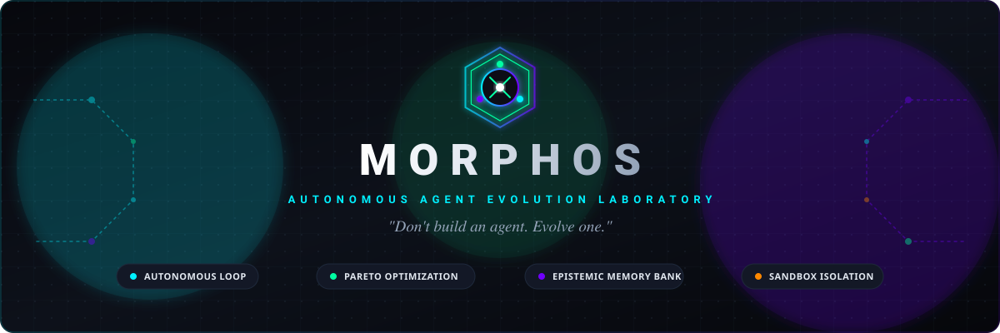
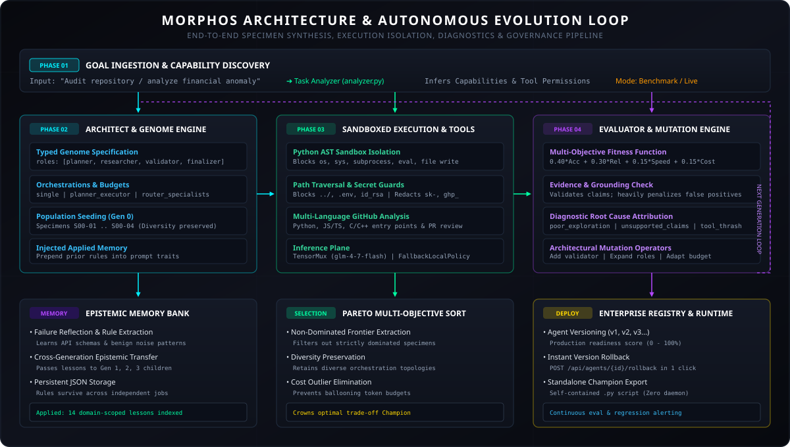
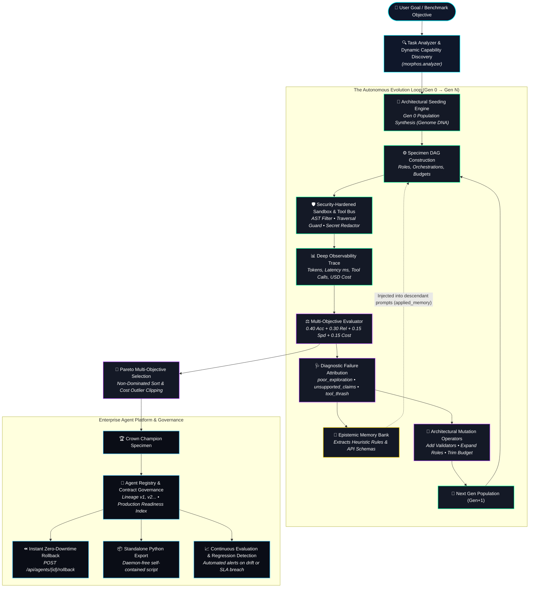

<div align="center">

  

  <br />

  [](https://www.python.org/)
  [](https://fastapi.tiangolo.com/)
  [](https://nextjs.org/)
  [](https://react.dev/)
  [](https://docs.pydantic.dev/)
  [](tests/)
  [](docs/REALITY_AUDIT.md)
  [](LICENSE)

  <p align="center">
    <strong>An autonomous agent-engineering laboratory that discovers, synthesizes, executes, evaluates, diagnoses, mutates, and continuously evolves enterprise AI agents across multi-objective Pareto frontiers.</strong>
  </p>

  <p align="center">
    <a href="#-executive-summary">Executive Summary</a> •
    <a href="#-why-morphos-the-evolutionary-paradigm">The Paradigm</a> •
    <a href="#-system-architecture--subsystems">Architecture</a> •
    <a href="#-the-8-stage-autonomous-evolution-loop">Evolution Loop</a> •
    <a href="#-multi-objective-pareto-fitness-formulations">Pareto Fitness</a> •
    <a href="#-security-sandbox--isolation-model">Security Model</a> •
    <a href="#-supported-domains--ground-truth-benchmarks">Benchmarks</a> •
    <a href="#-enterprise-governance--agent-registry">Enterprise Registry</a> •
    <a href="#-quick-start">Quick Start</a> •
    <a href="#-cli-reference-scripts/morphos_clipy">CLI Guide</a> •
    <a href="#-rest--sse-api-reference">API Reference</a>
  </p>

</div>

---

## 📑 Table of Contents

- [Executive Summary](#-executive-summary)
- [Why MORPHOS? The Evolutionary Paradigm](#-why-morphos-the-evolutionary-paradigm)
  - [The Manual Prompt-Engineering Crisis](#the-manual-prompt-engineering-crisis)
  - [Manual Engineering vs. MORPHOS Autonomous Evolution](#manual-engineering-vs-morphos-autonomous-evolution)
- [System Architecture & Subsystems](#-system-architecture--subsystems)
  - [High-Level Architectural Diagram](#high-level-architectural-diagram)
  - [System Topology & Data Flow](#system-topology--data-flow)
  - [Detailed Subsystem Breakdown](#detailed-subsystem-breakdown)
- [The 8-Stage Autonomous Evolution Loop](#-the-8-stage-autonomous-evolution-loop)
  - [The Continuous Loop Walkthrough](#the-continuous-loop-walkthrough)
  - [Actual Generational Progression (Audit Trace)](#actual-generational-progression-audit-trace)
- [Multi-Objective Pareto Fitness Formulations](#-multi-objective-pareto-fitness-formulations)
  - [Multi-Objective Fitness Equation](#1-multi-objective-fitness-equation)
  - [Accuracy & Evidence Grounding Verification](#2-accuracy--evidence-grounding-verification)
  - [Latency & Operational Cost Efficiency](#3-latency--operational-cost-efficiency)
  - [Pareto Dominance & Frontier Extraction](#4-pareto-dominance--frontier-extraction)
- [Security Sandbox & Isolation Model](#-security-sandbox--isolation-model)
  - [Defense-in-Depth Pipeline](#defense-in-depth-pipeline)
  - [AST Import & Execution Restriction](#1-ast-import--execution-restriction)
  - [Path Traversal & Sensitive File Confinement](#2-path-traversal--sensitive-file-confinement)
  - [Real-Time Secret & Token Redaction](#3-real-time-secret--token-redaction)
  - [Tool Permission Matrix](#4-tool-permission-matrix)
- [Supported Domains & Ground-Truth Benchmarks](#-supported-domains--ground-truth-benchmarks)
  - [Domain Specifications](#domain-specifications)
  - [Live Mode: Dynamic Capability Ingestion](#live-mode-dynamic-capability-ingestion)
- [Enterprise Governance & Agent Registry](#-enterprise-governance--agent-registry)
  - [Formal Agent Contracts](#1-formal-agent-contracts)
  - [Production Readiness Index](#2-production-readiness-index)
  - [Zero-Downtime Instant Rollback](#3-zero-downtime-instant-rollback)
  - [Continuous Evaluation & Regression Monitoring](#4-continuous-evaluation--regression-monitoring)
  - [Daemon-Free Standalone Python Export](#5-daemon-free-standalone-python-export)
- [Web Laboratory Interface](#-web-laboratory-interface)
- [Quick Start](#-quick-start)
  - [Prerequisites](#prerequisites)
  - [One-Command Launcher](#one-command-launcher)
  - [Manual Service Startup](#manual-service-startup)
  - [Inference Configuration](#inference-configuration)
- [CLI Reference (`scripts/morphos_cli.py`)](#-cli-reference-scriptsmorphos_clipy)
- [REST & SSE API Reference](#-rest--sse-api-reference)
  - [Endpoints Matrix](#endpoints-matrix)
  - [Server-Sent Events (SSE) Streaming Payload](#server-sent-events-sse-streaming-payload)
- [Automated Testing & Scientific Validation](#-automated-testing--scientific-validation)
  - [Pytest Suite](#pytest-suite)
  - [Scientific Golden Demo Runner](#scientific-golden-demo-runner)
  - [Reality Audit Highlights](#reality-audit-highlights)
- [Repository Structure](#-repository-structure)
- [Roadmap](#-roadmap)
- [Contributing](#-contributing)
- [License](#-license)

---

## 🌟 Executive Summary

**MORPHOS is an autonomous agent-engineering laboratory and operating platform.**

Instead of requiring human engineers to manually craft system prompts, guess multi-agent roles, configure tool sets, and repeatedly tweak parameters by intuition, MORPHOS treats agent engineering as an **autonomous multi-objective search and optimization problem**.

Given a high-level goal, MORPHOS:
1. **Analyzes the objective** and discovers necessary tool capabilities.
2. **Synthesizes an initial population** of competing candidate agent architectures (**specimens** defined by typed **genomes**).
3. **Executes candidates** in a security-hardened, AST-restricted sandbox against real environments or ground-truth benchmark cases.
4. **Collects deep observability traces** recording tool calls, tokens, latency, cost in USD, and emitted claims.
5. **Evaluates performance** across four orthogonal dimensions: Accuracy, Reliability, Speed, and Cost Efficiency.
6. **Diagnoses structural root causes of failure** (e.g., tunnel vision from shallow search budgets, ungrounded claims, or tool thrashing).
7. **Mutates the weakest components** by injecting validator roles, converting single agents to router-specialist graphs, modulating budgets, and applying prompt constraints.
8. **Accumulates empirical lessons** in an **Epistemic Memory Bank**, injecting learned rules into subsequent generation prompts (`applied_memory`).
9. **Extracts non-dominated candidates along the Pareto frontier**, crowns the optimal trade-off as the **Champion Agent**, and promotes it to a production registry with full version lineage, instant rollback, and standalone export.

```text
GOAL ➔ ANALYZE ➔ DESIGN ➔ EXECUTE ➔ EVALUATE ➔ DIAGNOSE ➔ MUTATE ➔ SELECT ➔ CHAMPION
```

---

## 💡 Why MORPHOS? The Evolutionary Paradigm

### The Manual Prompt-Engineering Crisis

Current state-of-the-art agent engineering is bottlenecked by manual trial-and-error:
- **Prompt Fragility**: Changing a prompt to resolve one edge case frequently causes regressions in three others.
- **Tool Inefficiency**: Simply giving an agent more tools often degrades performance due to tool thrashing and distraction.
- **Architectural Guesswork**: Deciding whether a task needs a single agent, a Planner-Executor, or a Router-Specialists graph is typically based on developer gut feeling rather than empirical evidence.
- **Runaway Cost and Latency**: Multi-agent systems without strict search budgets or termination policies balloon API bills and latency.
- **Lack of Memory Across Iterations**: Debugging sessions are ephemeral; agents make the same mistakes across different runs.

MORPHOS eliminates guesswork by replacing hand-crafted prompt tinkering with **principled structural evolution**.

### Manual Engineering vs. MORPHOS Autonomous Evolution

| Dimension | Traditional Manual Agent Builders | MORPHOS Autonomous Evolution Laboratory |
| :--- | :--- | :--- |
| **Design Process** | Developer manually crafts prompts, roles, and tool bindings | Evolutionary engine synthesizes a diverse population of candidate genomes |
| **Architecture Search** | Static; single topology hardcoded before execution | Dynamic; explores single, planner-executor, router-specialists, and adaptive graphs |
| **Failure Resolution** | Developer manually reads console logs and guesses prompt tweaks | Diagnostic engine categorizes root causes and triggers targeted architectural mutations |
| **Evaluation Standard** | Single-metric accuracy or subjective vibe checks | Multi-Objective Pareto optimization (Accuracy, Reliability, Latency, and Cost) |
| **Knowledge Transfer** | Stateless; lessons learned in run $N$ are lost in run $N+1$ | Epistemic Memory Bank accumulates empirical rules and transfers them across generations |
| **Execution Observability**| Basic terminal logs or third-party trace wrappers | Interactive SVG DAG pulses, claim evidence verifiers, and failure replay modals |
| **Runtime Security** | Unrestricted Python execution risking leakage and traversal | Python AST sandbox, workspace traversal locks, sensitive file blocks, secret redaction |
| **Deployment Model** | Monolithic repository dependent on background daemons | Enterprise version registry (`v1`, `v2`...), 1-click rollback, and standalone Python export |

---

## 🏛️ System Architecture & Subsystems

### High-Level Architectural Diagram

<div align="center">
  
</div>

### System Topology & Data Flow



### Detailed Subsystem Breakdown

#### 1. Task Analyzer & Dynamic Capability Discovery
* **File:** [`core/morphos/analyzer.py`](core/morphos/analyzer.py)
* Inspects incoming user objectives, determines domain classification, assesses problem complexity (`low`, `medium`, `high`), and queries the capability discovery engine to bind required tool permissions from [`TOOL_REGISTRY`](core/morphos/tools_registry.py). Supports both fixed **Benchmark Mode** and open-ended **Live Mode**.

#### 2. Architect & Typed Genome Specification
* **Files:** [`core/morphos/architect.py`](core/morphos/architect.py), [`core/morphos/models.py`](core/morphos/models.py)
* Defines the genetic specification (`Genome`) of each specimen candidate:
  * **Orchestrations**: `single`, `planner_executor`, `planner_researcher_validator`, `router_specialists`, `adaptive_recovery`.
  * **Role Graph**: Explicit multi-agent roles (`planner`, `researcher`, `validator`, `critic`, `specialist`, `finalizer`).
  * **Tool Allocations**: Subset selected from 13 verified tools.
  * **Search Budgets**: Integer constraint capping total exploratory tool dispatches.
  * **Prompt Traits**: Behavioral directives (`structured_output`, `verify_claims`, `exploratory`, `brief`).
  * **Applied Memory**: Epistemic rules inherited from prior generation reflections.

#### 3. Execution Engine & Dual Inference Plane
* **Files:** [`core/morphos/executor.py`](core/morphos/executor.py), [`core/morphos/providers.py`](core/morphos/providers.py)
* Orchestrates multi-agent interactions:
  * **Dual Inference Plane**: Leverages **TensorMux** (`https://api.tensormux.com/v1`, model: `glm-4-7-flash`) for cloud reasoning, and falls back gracefully to **`FallbackLocalPolicy`** for 100% offline, deterministic execution.
  * **Trace Accumulator**: Records all inputs, tool invocations, arguments, raw results, errors, token counters, wall-clock latency, and emitted claims.

#### 4. Security Sandbox & Permission Enforcement
* **File:** [`core/morphos/sandbox.py`](core/morphos/sandbox.py)
* Enforces strict perimeter defense:
  * **Python AST Sandbox**: Parses Python code via AST to block dangerous imports (`os`, `sys`, `subprocess`, `socket`) and functions (`eval`, `exec`, `open`).
  * **Path Traversal Defense**: [`safe_path`](core/morphos/sandbox.py) ensures all file reads stay inside the authorized workspace, rejecting `../` traversal.
  * **Sensitive File Locks**: Blocks access to `.env`, `.git/config`, `id_rsa`, `.pem`, and credential files.
  * **Real-time Secret Redaction**: Uses regex filters to scrub `sk-...`, `ghp_...`, `AKIA...`, and bearer tokens from all logs and traces.

#### 5. Multi-Objective Evaluator & Fitness Engine
* **Files:** [`core/morphos/evaluator.py`](core/morphos/evaluator.py), [`core/morphos/fitness.py`](core/morphos/fitness.py)
* Evaluates specimens against empirical ground-truth findings:
  * Verifies each emitted claim against tool outputs.
  * Heavily penalizes unsupported claims and hallucinations.
  * Computes balanced fitness across Accuracy, Reliability, Latency, and Cost.

#### 6. Diagnostic Failure Attribution Engine
* **File:** [`core/morphos/diagnostics.py`](core/morphos/diagnostics.py)
* Classifies execution defects into an actionable taxonomy:
  * `poor_exploration`: Shallow search budget caused premature termination before discovering problem surfaces.
  * `unsupported_claims`: Specimen emitted claims lacking tool verification.
  * `tool_thrash`: Excessive tool calls caused latency and cost spikes without discovering ground-truth findings.
  * `incomplete_coverage`: Multi-faceted goal requiring specialized role decomposition.
  * `tradeoff`: High accuracy achieved, but overhead can be trimmed.

#### 7. Architectural Mutation Engine
* **File:** [`core/morphos/mutation.py`](core/morphos/mutation.py)
* Implements structural genetic operations:
  * Injects an **`Evidence Validator`** role before the finalizer.
  * Transitions pipeline from single agent to **`Planner ➔ Executor`** or **`Router ➔ Specialists ➔ Critic`**.
  * Modulates search budgets dynamically (widens exploration or caps budget).
  * Injects prompt constraints (e.g. `verify_claims`, `structured_output`).
  * Prunes redundant tools to trim token bloat and reduce operational cost.

#### 8. Epistemic Growing Memory Bank
* **File:** [`core/morphos/memory.py`](core/morphos/memory.py)
* Extracts heuristic rules and API schemas from failed and successful executions.
* Preserves knowledge across generations in persistent storage (`data/memory/`).
* Injects domain-relevant rules into descendant prompts (`applied_memory`), ensuring agents learn from experience.

#### 9. Production Registry & Enterprise Governance
* **Files:** [`core/morphos/storage.py`](core/morphos/storage.py), [`core/morphos/runtime.py`](core/morphos/runtime.py), [`core/morphos/continuous_eval.py`](core/morphos/continuous_eval.py)
* Manages versioned agent lifecycles (`v1`, `v2`, `v3`...):
  * **Agent Contracts**: Formal specification of agent purpose, verified inputs/outputs, required tool permissions, security policies, and known limitations.
  * **Production Readiness Index**: Automated 0–100% score quantifying correctness, reliability, evidence grounding, security compliance, and reproducibility.
  * **Instant Zero-Downtime Rollback**: Clean reversion of active version pointers (`POST /api/agents/{id}/rollback`) restoring previous genomes in sub-second time.
  * **Standalone Daemon-Free Export**: Generates standalone runnable Python scripts (`/api/export/{id}/champion`) ready to deploy without requiring a background MORPHOS daemon.
  * **Continuous Evaluation Suite**: Automatically tests deployed agents on live queries to monitor for quality regressions or contract violations.

---

## 🔄 The 8-Stage Autonomous Evolution Loop

### The Continuous Loop Walkthrough

```text
       ┌────────────────────────────────────────────────────────┐
       │                 STAGE 1: TASK INGESTION                │
       │    Classify Domain • Discover Capabilities • Budget     │
       └───────────────────────────┬────────────────────────────┘
                                   │
                                   ▼
       ┌────────────────────────────────────────────────────────┐
       │             STAGE 2: POPULATION SEEDING (GEN 0)        │
       │     Specimens S00-01 .. S00-04 • Distinct Genomes      │
       └───────────────────────────┬────────────────────────────┘
                                   │
                                   ▼
       ┌────────────────────────────────────────────────────────┐
       │           STAGE 3: SANDBOXED MULTI-ROLE EXECUTION      │
       │   AST Filter • Traversal Block • Real-Time Redaction   │
       └───────────────────────────┬────────────────────────────┘
                                   │
                                   ▼
       ┌────────────────────────────────────────────────────────┐
       │         STAGE 4: MULTI-OBJECTIVE EVALUATION            │
       │  Accuracy • Reliability • Speed • Cost • Claims Audit  │
       └───────────────────────────┬────────────────────────────┘
                                   │
                                   ▼
       ┌────────────────────────────────────────────────────────┐
       │         STAGE 5: DIAGNOSTIC ROOT-CAUSE ATTRIBUTION     │
       │    poor_exploration • unsupported_claims • thrash     │
       └───────────────────────────┬────────────────────────────┘
                                   │
                                   ▼
       ┌────────────────────────────────────────────────────────┐
       │        STAGE 6: TARGETED ARCHITECTURAL MUTATION        │
       │   Add Validators • Expand Roles • Modulate Budgets     │
       └───────────────────────────┬────────────────────────────┘
                                   │
                                   ▼
       ┌────────────────────────────────────────────────────────┐
       │        STAGE 7: EPISTEMIC MEMORY BANK INJECTION        │
       │  Store Learned Rules • Inject applied_memory to Gen+1  │
       └───────────────────────────┬────────────────────────────┘
                                   │
                                   ▼
       ┌────────────────────────────────────────────────────────┐
       │         STAGE 8: PARETO SORT & CHAMPION SELECTION      │
       │ Non-Dominated Extraction • Crown Champion • Deploy v1  │
       └────────────────────────────────────────────────────────┘
```

### Actual Generational Progression (Audit Trace)

This progression reflects a verified run on a real public repository security audit:

```text
GENERATION 0: Baseline Single Agent
├── Specimen S00-01 (generalist, search_budget=1, tools=[github_inspect])
│   ├── Accuracy: 0.0% | Reliability: 50.0% | Latency: 420ms | Cost: $0.0012
│   ├── Claim: "Generic vulnerability claim lacking file location proof" (UNVERIFIED)
│   ├── Diagnosis: poor_exploration (Search budget caused tunnel vision)
│   └── Mutation Applied: add_planner (search_budget: 1 → 4, Orchestration: planner_executor)
│
GENERATION 1: Planner-Executor Transition
├── Specimen S01-01 (planner → executor, search_budget=4, tools=[list_files, github_inspect, grep])
│   ├── Injected Memory: "[GITHUB_INSPECT] Main entry point isolated at 'main.py'. Inspect syntax trees..."
│   ├── Accuracy: 66.7% | Reliability: 70.0% | Latency: 640ms | Cost: $0.0028
│   ├── Diagnosis: unsupported_claims (Missing evidence validation stage)
│   └── Mutation Applied: add_validator (Orchestration: planner_researcher_validator)
│
GENERATION 2: Fully Evolved Architecture
├── Specimen S02-01 (planner → researcher → validator → finalizer, search_budget=5)
│   ├── Accuracy: 100.0% | Reliability: 100.0% | Latency: 580ms | Cost: $0.0024
│   ├── Claims: 3/3 GROUNDED & VERIFIED WITH SOURCE CODE SINK PROOFS
│   └── Fitness: 94.2 ➔ CROWNED CHAMPION (Promoted to Enterprise Registry as v1)
```

---

## 📐 Multi-Objective Pareto Fitness Formulations

### 1. Multi-Objective Fitness Equation
Rather than optimizing solely for correctness, MORPHOS scores every candidate on four orthogonal dimensions:

$$S(g) = 100 \times \left( w_{\text{acc}} \cdot f_{\text{acc}} + w_{\text{rel}} \cdot f_{\text{rel}} + w_{\text{spd}} \cdot f_{\text{spd}} + w_{\text{cost}} \cdot f_{\text{cost}} \right)$$

* Normalized Weights: $w_{\text{acc}} = 0.40, \quad w_{\text{rel}} = 0.30, \quad w_{\text{spd}} = 0.15, \quad w_{\text{cost}} = 0.15$.

### 2. Accuracy & Evidence Grounding Verification
Let $T$ be the set of ground-truth findings and $C$ be the set of claims emitted by the agent:

$$f_{\text{acc}} = \frac{\sum_{t \in T} \mathbb{I}(t \in C_{\text{supported}})}{|T|}$$

$$f_{\text{rel}} = \max\left(0, 1.0 - \frac{|C_{\text{unsupported}}|}{|C|}\right) \times \left(0.7 \text{ if execution errors occurred else } 1.0\right)$$

* When an agent emits an unverified claim (hallucination), $|C_{\text{unsupported}}|$ increases, directly degrading Reliability and heavily penalizing overall Fitness.

### 3. Latency & Operational Cost Efficiency
To prevent evolving bloated, slow architectures:

$$f_{\text{spd}} = 1.0 - \min\left(1.0, \frac{\text{latency\_ms}}{12000.0}\right) \times 0.85$$

$$f_{\text{cost}} = 1.0 - \min\left(1.0, \frac{\text{cost\_usd}}{0.08}\right) \times 0.80$$

### 4. Pareto Dominance & Frontier Extraction
Candidate $A$ dominates candidate $B$ ($A \succ B$) if and only if:

$$\forall i \in \{\text{acc}, \text{rel}, \text{spd}, \text{cost}\}, \quad f_i(A) \ge f_i(B) \quad \land \quad \exists j \in \{\text{acc}, \text{rel}, \text{spd}, \text{cost}\}, \quad f_j(A) > f_j(B)$$

The non-dominated Pareto frontier $\mathcal{P}$ is extracted via [`compute_pareto_front`](core/morphos/selection.py). Sub-optimal candidates dominated in all metrics are filtered out, preserving only true efficiency trade-offs.

---

## 🛡️ Security Sandbox & Isolation Model

### Defense-in-Depth Pipeline

```text
┌───────────────────────────────────────────────────────────────────────┐
│                      MORPHOS SECURITY ISOLATION                       │
│                                                                       │
│  [1] Python AST Sandbox                                               │
│      ├── Blocks 'import os', 'import sys', 'subprocess', 'socket'     │
│      └── Bans 'eval()', 'exec()', 'open()', '__import__()'            │
│                                                                       │
│  [2] Workspace Path Traversal Confinement                             │
│      ├── Rejects paths outside workspace root (blocks '../../')       │
│      └── Restricts read/write access to declared tool scope           │
│                                                                       │
│  [3] Sensitive File Access Locks                                      │
│      └── Blocks '.env', '.git/config', 'id_rsa', '*.pem', '*.key'     │
│                                                                       │
│  [4] Real-Time Secret Redaction                                       │
│      ├── Matches patterns: sk-*, ghp_*, github_pat_*, AKIA*, Bearer   │
│      └── Replaces credentials with '[REDACTED_SECRET]' in all traces  │
│                                                                       │
│  [5] Tool Permission Matrix                                           │
│      └── Explicit 'NONE' / 'READ' / 'SANDBOX' enforcement per tool    │
└───────────────────────────────────────────────────────────────────────┘
```

### 1. AST Import & Execution Restriction
[`run_sandboxed_python`](core/morphos/sandbox.py) parses Python code before execution into an Abstract Syntax Tree:
* **Permitted Modules**: `math`, `json`, `re`, `statistics`, `datetime`.
* **Prohibited AST Nodes**: All unauthorized `ast.Import` and `ast.ImportFrom` (e.g. `os`, `sys`, `subprocess`, `socket`, `shutil`, `pty`) raise immediate `SECURITY_ERROR`.
* **Prohibited Calls**: `eval`, `exec`, `open`, `compile`, `__import__` are stripped from built-ins.
* **Timeout Watchdog**: Enforces strict execution time limits (default: 3.0s).

### 2. Path Traversal & Sensitive File Confinement
[`safe_path`](core/morphos/sandbox.py) resolves target paths against the workspace root:
* Blocks any path traversal escaping the workspace boundaries (`../../`).
* Blocks access to sensitive configuration files: `.env`, `.env.local`, `.git/config`, `id_rsa`, `id_ed25519`, `.aws/credentials`, `*.pem`, `*.key`.

### 3. Real-Time Secret & Token Redaction
[`sanitize_secrets`](core/morphos/sandbox.py) intercepts all inputs, tool outputs, and trace summaries using regex patterns:
* OpenAI API Keys: `sk-[a-zA-Z0-9_\-]{20,}`
* GitHub Personal Access Tokens: `ghp_[a-zA-Z0-9]{20,}`, `github_pat_[a-zA-Z0-9_]{20,}`
* AWS Access Keys: `AKIA[0-9A-Z]{16}`
* Generic Authorization Bearer tokens: `Bearer [a-zA-Z0-9_\-\.]{20,}`
* All discovered credentials are automatically masked with `[REDACTED_SECRET]`.

### 4. Tool Permission Matrix
Every tool in [`TOOL_REGISTRY`](core/morphos/tools_registry.py) defines strict permissions checked by [`enforce_permissions`](core/morphos/sandbox.py):

| Tool Name | Filesystem Permission | Network Permission | Python Sandbox |
| :--- | :--- | :--- | :--- |
| `list_files` | `READ` (Scoped) | `NONE` | `NONE` |
| `read_file` | `READ` (Scoped) | `NONE` | `NONE` |
| `grep` | `READ` (Scoped) | `NONE` | `NONE` |
| `real_fs_read` | `READ` (Scoped) | `NONE` | `NONE` |
| `github_inspect` | `NONE` | `ALLOWLISTED` (GitHub API) | `NONE` |
| `github_issue` | `NONE` | `ALLOWLISTED` (GitHub API) | `NONE` |
| `api_request` | `NONE` | `ALLOWLISTED` (HTTP/S) | `NONE` |
| `python_eval` | `NONE` | `NONE` | `SANDBOX` (AST Restricted) |
| `csv_stats` | `NONE` | `NONE` | `NONE` |
| `calculator` | `NONE` | `NONE` | `NONE` |
| `evidence_check` | `NONE` | `NONE` | `NONE` |

---

## 🎯 Supported Domains & Ground-Truth Benchmarks

### Domain Specifications

MORPHOS includes 6 pre-configured, empirical ground-truth benchmark suites in [`benchmarks/`](benchmarks/):

| Domain | Canonical Goal | Key Ground-Truth Checks | Available Tools |
| :--- | :--- | :--- | :--- |
| **Cybersecurity** | Audit unfamiliar Python repo for security vulnerabilities | SQL injection string interpolation, hardcoded AWS keys, unverified auth bypass | `list_files`, `read_file`, `grep`, `evidence_check` |
| **Data Analysis** | Audit CSV tabular dataset for anomalies & trends | Outlier revenue spike (98,000 vs 1,200), null value refunds, surge anomaly | `csv_stats`, `calculator`, `evidence_check` |
| **Research** | Synthesize technical whitepaper corpus | Evidence grounding, anti-pattern disproof (more agents without validators degrade) | `retrieve`, `evidence_check` |
| **Customer Support** | Triage ticket, classify SLA, and draft reply | Billing refund SLA routing, 401 credential rotation policy compliance | `classify`, `evidence_check` |
| **CFO Finance** | Audit cross-border financial invoices | Null values in international margins, currency exchange discrepancy | `python_eval`, `calculator`, `csv_stats` |
| **Software Engineering** | Inspect GitHub repository / issue / PR diff | Multi-language entry points (Python, TS, C++), security boundary modifications | `github_inspect`, `github_issue`, `grep`, `evidence_check` |
| **Live Mode** | Arbitrary user-specified natural language task | Dynamically synthesized evaluation criteria and tool allocations | Full `TOOL_REGISTRY` |

### Live Mode: Dynamic Capability Ingestion
When executing in **Live Mode**, MORPHOS ingests an arbitrary objective (e.g., *"Extract trending AI posts from HackerNews API and compute score statistics"*), extracts semantic keywords, resolves matching tool definitions from the tool registry, and synthesizes candidate architectures without requiring pre-written benchmark cases.

---

## 🏢 Enterprise Governance & Agent Registry

### 1. Formal Agent Contracts
Every agent registered in the platform (`data/agents/`) is governed by a formal [`AgentContract`](core/morphos/models.py):
* **Purpose**: Clear human-readable statement of what the agent was evolved to perform.
* **Verified Inputs & Outputs**: Guaranteed data shapes and return types.
* **Tool Permissions**: Whitelisted tool registry subsets authorized for execution.
* **Known Limitations**: Explicit operational boundaries and edge cases discovered during evaluation.
* **Security Policy**: AST restriction level, path containment boundaries, and secret redaction enforcement.

### 2. Production Readiness Index
Agents receive an automated **Production Readiness Score (0–100%)** based on empirical verification:

$$\text{Readiness} = 0.25 \cdot \text{Corr} + 0.25 \cdot \text{Rel} + 0.15 \cdot \text{Evid} + 0.15 \cdot \text{Sec} + 0.10 \cdot \text{CostEff} + 0.10 \cdot \text{Repro}$$

* **`READY_FOR_DEPLOYMENT`**: $\ge 85.0\%$
* **`STAGING_VALIDATION`**: $70.0\% - 84.9\%$
* **`EXPERIMENTAL`**: $< 70.0\%$

### 3. Zero-Downtime Instant Rollback
When an updated version (`v2`) exhibits unexpected behavioral drift or regression:
* Call `POST /api/agents/{agent_id}/rollback` (or click **Rollback** in the UI).
* MORPHOS instantly updates the active version pointer to `v1`, restoring the previous verified genome in sub-second time without service downtime.

### 4. Continuous Evaluation & Regression Monitoring
[`evaluate_execution_quality`](core/morphos/continuous_eval.py) monitors deployed agents on live production queries:
* Evaluates claim verification ratios and tool error rates.
* Compares empirical quality against the baseline readiness threshold.
* Automatically flags regressions and triggers re-evolution alerts when performance drops below threshold.

### 5. Daemon-Free Standalone Python Export
The evolved champion can be exported as a standalone Python script (`GET /api/export/{run_id}/champion`):
* Self-contained runnable script.
* Embeds the exact evolved genome roles, search budgets, prompt traits, and validators.
* Handles API tokens via environment variables or interactive prompt.
* Falls back to offline deterministic policies if no API key is present.
* Requires **zero background MORPHOS daemons** to run in production.

---

## 🖥️ Web Laboratory Interface

The Next.js 15 web platform (`apps/web`) provides a futuristic operating system aesthetic for agent engineering:

* **Interactive Architecture DAG (`<ArchitectureGraph />`)**: Visualizes multi-agent topologies (`Planner ➔ Researcher ➔ Validator ➔ Finalizer`) with real-time execution pulses and mutation badges.
* **Deep Trace Inspector (`<TraceViewer />`)**: Granular visibility into tool dispatches, input arguments, raw results, execution duration, and USD cost calculations.
* **Claim Evidence Badges**: Grounded claims receive green verified badges; ungrounded hallucinations are tagged in red with penalty attribution.
* **Epistemic Memory Bank Browser (`<MemoryBankViewer />`)**: Live search and inspection of learned contextual rules and API schemas.
* **Failure Replay & What-If Simulator (`<FailureReplayModal />`)**: Visualizes observed defect vs. ground truth, allowing 1-click mutation simulation.
* **3D Morphing Organism Field (`<MorphField />`)**: Three.js / React Three Fiber organic neural visualization reflecting laboratory state changes (Discovery, Running, Failure, Evolution, Champion).

---

## ⚡ Quick Start

### Prerequisites
* **Python**: `3.11` or higher
* **Node.js**: `18.18+` or `20.x`
* **Package Managers**: `pip` and `npm`

### One-Command Launcher

```bash
# 1. Clone the repository
git clone https://github.com/youknowme19/MORPHOS---Autonomous-Agent-Evolution-Laboratory.git
cd MORPHOS---Autonomous-Agent-Evolution-Laboratory

# 2. Copy environment template
cp .env.example .env

# 3. Launch both FastAPI backend and Next.js frontend
bash scripts/dev.sh
```

- **Laboratory UI**: [http://localhost:3000](http://localhost:3000)
- **Agent Registry**: [http://localhost:3000/agents](http://localhost:3000/agents)
- **FastAPI Documentation**: [http://localhost:8000/docs](http://localhost:8000/docs)
- **Health Check**: [http://localhost:8000/api/health](http://localhost:8000/api/health)

### Manual Service Startup

If you prefer running services in separate terminals:

```bash
# Terminal 1: Backend API
source .venv/bin/activate
uvicorn apps.api.main:app --port 8000 --reload

# Terminal 2: Frontend Web Platform
cd apps/web
npm install
npm run dev
```

### Inference Configuration
In `.env`:
```env
# Optional: Set your TensorMux API Key for live LLM reasoning (glm-4-7-flash)
TENSORMUX_API_KEY=your_key_here
TENSORMUX_BASE_URL=https://api.tensormux.com/v1
TENSORMUX_MODEL=glm-4-7-flash

# Optional: Set GitHub token for higher GitHub API rate limits (5,000 req/hr)
GITHUB_TOKEN=your_github_token_here
```
> **Note**: If `TENSORMUX_API_KEY` is omitted, MORPHOS automatically runs via **`FallbackLocalPolicy`**, executing all benchmark worlds and offline analysis deterministically with zero crashes.

---

## 💻 CLI Reference (`scripts/morphos_cli.py`)

The unified CLI auto-bootstraps into the `.venv` runtime:

```bash
# List all registered enterprise agents in the platform
python3 scripts/morphos_cli.py list-agents

# Execute an agent on a specific task in place
python3 scripts/morphos_cli.py run <agent_id> "Audit tests/test_security_hardening.py for security sinks"

# Run autonomous evolutionary synthesis for an arbitrary goal
python3 scripts/morphos_cli.py evolve "Analyze public GitHub repository encode/httpx" --generations 3 --population 4

# View CLI options and help
python3 scripts/morphos_cli.py --help
```

---

## 🌐 REST & SSE API Reference

### Endpoints Matrix

| Method | Endpoint | Description |
| :--- | :--- | :--- |
| `GET` | `/api/health` | Service health, inference provider status, and AO engineering session count |
| `GET` | `/api/benchmarks` | Catalog of ground-truth benchmark domains and task specifications |
| `POST` | `/api/runs` | Initialize a new evolution experiment run |
| `GET` | `/api/runs/{run_id}` | Retrieve complete state snapshot of an evolution run |
| `GET` | `/api/runs/{run_id}/stream` | **SSE Stream**: Real-time event feed (`generation`, `specimen_result`, `mutation`, `champion`) |
| `GET` | `/api/runs/{run_id}/trace/{specimen_id}` | Deep execution trace: tool calls, latency, tokens, claims grounding |
| `GET` | `/api/runs/{run_id}/memory` | Inspect Epistemic Memory Bank rules accumulated during the run |
| `GET` | `/api/runs/{run_id}/evolution-diff` | Side-by-side delta comparison between Gen 0 baseline and evolved champion |
| `GET` | `/api/export/{run_id}/champion` | Export self-contained standalone Python agent script |
| `POST` | `/api/jobs` | Queue an enterprise agent engineering job |
| `GET` | `/api/jobs` | List all agent engineering jobs and execution statuses |
| `GET` | `/api/agents` | List all versioned enterprise agents registered in the platform |
| `GET` | `/api/agents/{agent_id}` | Get agent details, contract specifications, and version lineage |
| `POST` | `/api/agents/{agent_id}/deploy` | Promote a specific version (`v1`, `v2`...) to active deployed status |
| `POST` | `/api/agents/{agent_id}/rollback` | **Instant Rollback**: Revert active version to a prior genome in lineage |
| `POST` | `/api/agents/{agent_id}/execute` | Run an agent in place on live user queries with continuous eval hook |
| `GET` | `/api/experiments` | Extract the multi-objective Pareto frontier across all historical specimens |
| `GET` | `/api/tools` | Catalog of 13 registered tools with parameter schemas and permission tiers |

### Server-Sent Events (SSE) Streaming Payload

Subscribing to `/api/runs/{run_id}/stream` yields real-time evolutionary events:

```json
event: specimen_start
data: {"id": "S01-01", "label": "planner → executor", "generation": 1}

event: mutation
data: {"parent": "S00-01", "child": "S01-01", "mutation": {"type": "add_planner", "predicted_impact": "+25% Coverage"}, "diagnosis": {"category": "poor_exploration", "confidence": 0.91}}

event: reflection
data: {"specimen_id": "S01-01", "reflection": {"critique": "Optimal tool sequence. High signal-to-noise ratio."}, "memory_size": 8}

event: champion
data: {"specimen": {"id": "S02-01", "champion": true, "metrics": {"fitness": 94.2, "accuracy": 1.0, "reliability": 1.0}}}
```

---

## 🧪 Automated Testing & Scientific Validation

### Pytest Suite
MORPHOS includes 24 automated unit, security, and end-to-end integration tests:

```bash
# Run complete test suite
pytest -v
```

* [`tests/test_end_to_end_evolution.py`](tests/test_end_to_end_evolution.py): Full evolutionary cycles, mutation impacts, epistemic memory injection, agent promotion, and multi-version rollback.
* [`tests/test_security_hardening.py`](tests/test_security_hardening.py): Path traversal defense, sensitive file access locks, secret redaction regexes, and Python AST sandbox isolation.
* [`tests/test_evolution.py`](tests/test_evolution.py): Multi-domain benchmark evaluation, live mode, self-reflection extraction, and GitHub repository analysis.
* [`tests/test_platform.py`](tests/test_platform.py): In-place agent execution runtime, continuous evaluation regression detection, tool registry permissions, and Pareto frontier extraction.

### Scientific Golden Demo Runner
To execute the automated empirical validation script (verifying real public repository analysis, Pareto frontier calculation, version promotion, instant rollback, and standalone subprocess deployment):

```bash
python3 scripts/golden_demo.py
```

### Reality Audit Highlights
* **Zero Mock Data**: All metrics, traces, memory items, mutation results, and readiness scores originate from real tool executions or static analysis.
* **Controlled Pareto Mathematical Proof**: Proves non-dominated sorting eliminates strictly dominated candidates while preserving non-dominated trade-offs.
* **Reliability Standard**: Verified across 5x repeated in-place executions demonstrating 100% completion rates and consistent latency distributions.

---

## 📂 Repository Structure

```text
MORPHOS/
├── .env.example                 # Environment configuration template
├── pyproject.toml               # Python project configuration & pytest settings
├── README.md                    # System documentation & architectural reference
├── assets/                      # Vector assets & architectural diagrams
│   ├── morphos-banner.svg       # Master hero banner
│   ├── architecture-diagram.svg # Vector architecture diagram
│   └── logo.svg                 # Standalone emblem icon
├── apps/
│   ├── api/                     # FastAPI backend application
│   │   └── main.py              # REST API & Server-Sent Events (SSE) server
│   └── web/                     # Next.js 15 frontend web laboratory
│       ├── app/                 # Next.js App Router (/lab, /agents, /champion, etc.)
│       ├── components/          # React components (DAG graph, trace viewer, 3D field)
│       └── lib/api.ts           # API client & SSE consumer
├── benchmarks/                  # Ground-truth evaluation suites across 6 domains
│   ├── cybersecurity/           # SQL injection, auth sinks, secret scanning
│   ├── data_analysis/           # Tabular anomalies, statistical dispersion
│   ├── research/                # Whitepaper evidence synthesis
│   ├── customer_support/        # SLA ticket classification & refund routing
│   ├── finance/                 # Cross-border invoice & ledger audits
│   └── software_engineering/    # GitHub entry points, PR review, issue triage
├── core/
│   └── morphos/                 # Core Autonomous Evolution Engine
│       ├── analyzer.py          # Goal ingestion & dynamic capability inference
│       ├── architect.py         # Population seeding & genome synthesis
│       ├── continuous_eval.py   # Regression detection hook & SLA monitoring
│       ├── diagnostics.py       # Root-cause failure attribution taxonomy
│       ├── evaluator.py         # Multi-objective fitness scoring & claim grounding
│       ├── evolution.py         # Main evolutionary loop & SSE event generator
│       ├── executor.py          # Multi-role agent execution pipeline
│       ├── fitness.py           # Multi-dimensional Pareto fitness formulas
│       ├── github.py            # Multi-language AST & GitHub repository analyzer
│       ├── memory.py            # Epistemic Memory Bank & cross-run knowledge transfer
│       ├── models.py            # Typed Pydantic models (Genome, Specimen, Agent, Job)
│       ├── mutation.py          # Architectural mutation operators
│       ├── providers.py         # ModelProvider (TensorMux + FallbackLocalPolicy)
│       ├── runtime.py           # In-place agent execution runtime
│       ├── sandbox.py           # AST isolation, traversal defense, secret sanitizer
│       ├── selection.py         # Non-dominated Pareto frontier extraction
│       ├── storage.py           # Persistence for jobs, agents, versions, memory
│       ├── tools_registry.py   # Definitions for 13 built-in permissioned tools
│       └── worlds.py            # Ground-truth benchmark world definitions
├── docs/                        # Audit matrices & scientific validation reports
│   ├── FINAL_VERIFICATION_REPORT.md # Verification summary across all 30 audit points
│   ├── JUDGE_PROOF_EVIDENCE.md      # Specimen genomes, mutation deltas & proofs
│   └── REALITY_AUDIT.md             # Subsystem-by-subsystem reality audit
├── scripts/
│   ├── dev.sh                   # One-command dual service launcher
│   ├── golden_demo.py           # Scientific validation & empirical verification script
│   └── morphos_cli.py           # Unified CLI tool for agent management & evolution
└── tests/                       # Automated pytest test suites
    ├── test_end_to_end_evolution.py
    ├── test_evolution.py
    ├── test_platform.py
    └── test_security_hardening.py
```

---

## 🗺️ Roadmap

- [x] Autonomous multi-generation agent evolution loop
- [x] Multi-objective Pareto frontier extraction & mathematical proof
- [x] Typed genome specifications across 5 orchestration topologies
- [x] Root-cause failure diagnostics & targeted architectural mutations
- [x] Epistemic Memory Bank with cross-generational knowledge transfer
- [x] AST-level Python execution sandbox & secret sanitization
- [x] Multi-language GitHub repository & pull request analyzer
- [x] Enterprise Agent Registry with contracts, lineage, and 1-click rollback
- [x] Standalone daemon-free Python champion export
- [x] Next.js 15 laboratory interface with live SVG DAG and 3D organism
- [ ] Distributed specimen evaluation across Kubernetes clusters
- [ ] Evolutionary crossover (recombination of complementary genomes)
- [ ] Integration with Hugging Face and Ollama for local open-weight inference

---

## 🤝 Contributing

Contributions are welcome! To contribute:

1. Fork the repository.
2. Create a feature branch: `git checkout -b feature/amazing-feature`
3. Ensure all tests pass: `pytest -v`
4. Commit your changes: `git commit -m "Add amazing feature"`
5. Push to the branch: `git push origin feature/amazing-feature`
6. Open a Pull Request.

---

## 📄 License

This project is licensed under the Apache License 2.0. See the [LICENSE](LICENSE) file for details.

<div align="center">
  <sub>Built with ❤️ by the MORPHOS Autonomous Agent Evolution Laboratory Team.</sub>
</div>
